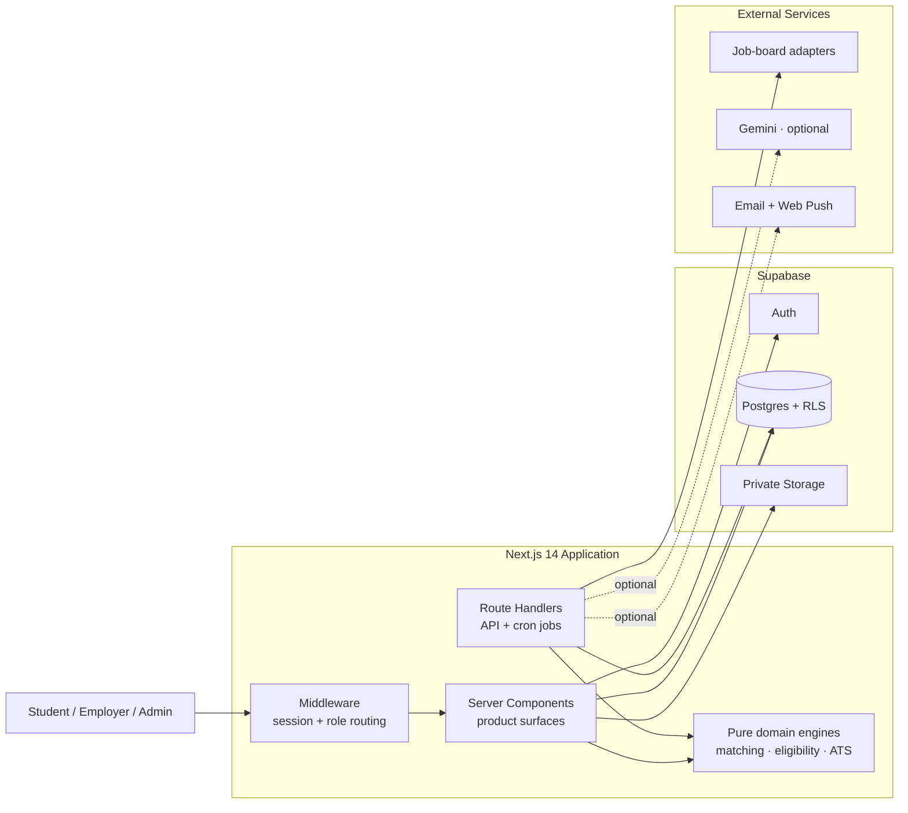

<div align="center">

<a href="https://github.com/Niloy-Bhuiyan/shuru">
  
</a>

### Find the right internship. Know where you really stand.

**Shuru** (শুরু — *the beginning*) is an internship platform for students that combines fresh opportunities, evidence-backed matching, application tracking, and an ATS-ready resume studio—without inventing confidence it cannot justify.

[](https://nextjs.org/)
[](https://www.typescriptlang.org/)
[](https://supabase.com/)
[](https://tailwindcss.com/)

[Explore features](#-what-shuru-does) · [See the architecture](#-architecture) · [Run locally](#-run-it-locally) · [Read the docs](#-documentation)

</div>

---

## The idea

Most internship platforms optimize for more listings and bigger match percentages. Shuru optimizes for **truthful decisions**.

> If there is enough evidence, Shuru explains the match. If there is not, it abstains. No fake score, no invented deadline, no made-up salary.

| The usual experience | The Shuru approach |
|---|---|
| Opaque “95% match” scores | Evidence is shown for every contributing signal |
| Stale or duplicated listings | Normalized, deduplicated, freshness-checked opportunities |
| Invented closing dates | Explicit **Rolling** labels when no real deadline exists |
| Generic resume advice | ATS checks and job-description-specific keyword analysis |
| Scattered application notes | A status timeline, vault, alerts, and notification center |

## ✦ What Shuru does

<table>
  <tr>
    <td width="50%" valign="top">
      <h3>◉ Internship Radar</h3>
      Discover employer-posted and responsibly ingested internships in one mobile-first feed. Every external listing is filtered, normalized, attributed, deduplicated, and freshness checked.
    </td>
    <td width="50%" valign="top">
      <h3>◎ Reality Check</h3>
      Compare a student profile with real historical outcomes. Small cohorts trigger an honest abstention instead of a statistically meaningless percentage.
    </td>
  </tr>
  <tr>
    <td width="50%" valign="top">
      <h3>◆ Resume Forge</h3>
      Upload PDF or DOCX resumes, edit structured sections, run rule-based ATS checks, tailor against a job description, and export a selectable, ATS-readable PDF.
    </td>
    <td width="50%" valign="top">
      <h3>▣ Application Vault</h3>
      Save opportunities, track every application stage, search the pipeline, and receive relevant deadline and status notifications.
    </td>
  </tr>
  <tr>
    <td width="50%" valign="top">
      <h3>⌁ Role-aware workspaces</h3>
      Purpose-built surfaces for students, employers, and admins—with authorization enforced by Postgres Row Level Security, middleware, and server-side role checks.
    </td>
    <td width="50%" valign="top">
      <h3>✦ Optional AI assistance</h3>
      Gemini can structure resumes and power contextual explanations. Without an API key, AI entry points disappear cleanly while every rule-based feature keeps working.
    </td>
  </tr>
</table>

## ◇ Honest odds, by design

Shuru’s Reality Check is intentionally conservative:

1. **Define success** — a past outcome of `shortlisted` or `offer`.
2. **Build a cohort** — same CGPA band and department; relax once to CGPA band only when needed.
3. **Check the sample** — `HIGH` confidence at `n ≥ 20`, `MED` at `8 ≤ n < 20`.
4. **Abstain when evidence is thin** — `n < 8` produces no score.
5. **Explain the result** — show the strongest evidence gap, with a five-point noise floor.

The core engines are pure, unit-tested functions in [`eligibility.ts`](./src/lib/eligibility.ts) and [`realityCheck.ts`](./src/lib/realityCheck.ts). Externally ingested listings have no outcome history, so Shuru automatically abstains on them.

## ⌘ Architecture

Shuru is a single Next.js application. Server Components and Route Handlers form the application layer; Supabase Postgres—with RLS—is the authorization boundary.



### Data flows

```text
LISTING INGESTION
source adapter → internship filter → normalize → deduplicate → freshness check → upsert

REALITY CHECK
profile + verified outcomes → cohort selection → sample threshold → score or abstain → evidence

RESUME FORGE
PDF/DOCX → text extraction → structured editor → ATS checks → JD tailoring → text-layer PDF

NOTIFICATIONS
domain event → notification row → in-app center → optional email / browser push
```

<details>
<summary><strong>Explore the repository structure</strong></summary>

```text
shuru/
├── src/
│   ├── app/
│   │   ├── (auth)/          # Authentication and onboarding
│   │   ├── (main)/          # Student, employer, and admin surfaces
│   │   └── api/             # Route handlers, ingestion, AI, notifications
│   ├── components/
│   │   ├── pixel/           # Cozy-retro design system primitives
│   │   └── forge/           # Resume Forge experience
│   └── lib/
│       ├── agent/           # Optional AI adapter and tool loop
│       ├── data/            # Domain-oriented data access
│       ├── ingest/          # Adapters, normalization, dedupe, refresh
│       ├── notify/          # In-app, email, and push delivery
│       └── resume/          # Extraction, ATS, JD match, PDF export
├── supabase/
│   ├── migrations/          # Ordered, additive SQL migrations
│   └── seed.sql             # Optional illustrative sample data
├── docs/                    # Product, architecture, database, operations
├── e2e/                     # Playwright responsive and auth journeys
└── public/                  # Static assets and service worker
```

</details>

## ⚙ Technology

| Layer | Built with |
|---|---|
| Web | Next.js 14 App Router, React 18, strict TypeScript |
| Interface | Tailwind CSS, custom pixel design system, responsive app shell |
| Data | Supabase Postgres, Auth, Storage, Row Level Security |
| Documents | `pdf-parse`, Mammoth, jsPDF |
| Intelligence | Pure matching/ATS engines; optional Gemini adapter |
| Background work | Vercel cron routes, modular listing adapters |
| Notifications | In-app records, email adapters, Web Push |
| Quality | Vitest, Playwright, ESLint, TypeScript |

## ▶ Run it locally

### Prerequisites

- Node.js 20+
- npm
- A Supabase project

```bash
git clone https://github.com/Niloy-Bhuiyan/shuru.git
cd shuru
npm install
cp .env.local.example .env.local
npm run dev
```

Open [`http://localhost:3000`](http://localhost:3000). Shuru does not ship a simulated backend: when Supabase is missing, it shows an explicit **Not configured** state instead of invented data.

### Minimum environment

```dotenv
NEXT_PUBLIC_SUPABASE_URL=your-project-url
NEXT_PUBLIC_SUPABASE_ANON_KEY=your-anon-key
SUPABASE_SERVICE_ROLE_KEY=your-service-role-key
NEXT_PUBLIC_SITE_URL=http://localhost:3000
```

The service-role key is server-only—never prefix it with `NEXT_PUBLIC_`. Optional ingestion sources, OAuth providers, Gemini, email, and Web Push are documented in [`.env.local.example`](./.env.local.example) and the [deployment guide](./docs/DEPLOYMENT.md).

### Prepare the database

Apply the SQL files in [`supabase/migrations`](./supabase/migrations) in filename order. The optional [`supabase/seed.sql`](./supabase/seed.sql) contains illustrative Bangladesh listings and outcomes; sample-derived results remain visibly labeled as sample data.

```bash
npm run migrate:status
npm run migrate
```

See the [Supabase guide](./supabase/README.md) for migration order and first-admin promotion.

## ✓ Quality checks

```bash
npm run typecheck     # TypeScript
npm run lint          # ESLint
npm test              # Vitest unit suite
npm run test:e2e      # Playwright at 390px and 1440px
npm run build         # Production build
```

The full release gate and failure triage live in the [operations runbook](./docs/RUNBOOK.md).

## 📚 Documentation

| Guide | Purpose |
|---|---|
| [Product requirements](./docs/PRD.md) | Users, scope, requirements, and non-goals |
| [Architecture](./docs/ARCHITECTURE.md) | Runtime shape, authorization, pipelines, and configuration |
| [Database](./docs/DATABASE.md) | Tables, RLS policies, constraints, and triggers |
| [Deployment](./docs/DEPLOYMENT.md) | Supabase/Vercel provisioning and production credentials |
| [Operations runbook](./docs/RUNBOOK.md) | Release gate, verification, ingestion triage, and limitations |
| [Decision records](./docs/decisions) | Load-bearing engineering decisions and their trade-offs |
| [Security audit](./ISSUES.md) | Previous findings and remediation record |

> [!IMPORTANT]
> Read [ADR 0001](./docs/decisions/0001-source-filtering.md) before changing source filters and [ADR 0002](./docs/decisions/0002-match-abstention.md) before changing score availability. Both encode deliberate honesty constraints that can look like bugs from the outside.

## Roles and trust boundaries

| Role | Capabilities |
|---|---|
| **Student** | Discover, evaluate, save, apply, track, build resumes, receive alerts |
| **Employer** | Maintain a company profile, post internships, manage applicants |
| **Admin** | Review employers/listings, moderate reports, inspect ingestion and audit logs |

There is no self-service role-escalation API. `public.user_roles` has no self-write policy; the first admin is promoted directly through the Supabase SQL Editor.

## Troubleshooting

<details>
<summary><strong>“NOT CONFIGURED” screen</strong></summary>

Set `NEXT_PUBLIC_SUPABASE_URL` and `NEXT_PUBLIC_SUPABASE_ANON_KEY`, and make sure they are not placeholder values.

</details>

<details>
<summary><strong>Redirect loop at login</strong></summary>

Confirm that `NEXT_PUBLIC_SITE_URL` exactly matches the origin in the browser and that the session cookie reaches middleware.

</details>

<details>
<summary><strong>OAuth button fails</strong></summary>

The UI flag and Supabase provider must both be enabled, and the provider callback URL must match `<site>/auth/callback`.

</details>

<details>
<summary><strong>Reality Check differs between users</strong></summary>

That is expected. Cohorts are calibrated by CGPA band and department, then relaxed once only when the sample is too small.

</details>

---

<div align="center">

### শুরু মানে সূচনা — go open some doors.

Built with care by [Niloy Bhuiyan](https://github.com/Niloy-Bhuiyan).

[Back to top](#)

</div>
