<div align="center">

<a href="https://github.com/Niloy-Bhuiyan/shuru">
  
</a>

### Find the right internship. Know where you really stand.

**Shuru** (শুরু — *the beginning*) is an internship platform for students that combines fresh opportunities, evidence-backed matching, application tracking, and an ATS-ready resume studio—without inventing confidence it cannot justify.

[](https://nextjs.org/)
[](https://www.typescriptlang.org/)
[](https://supabase.com/)
[](https://tailwindcss.com/)
[](./LICENSE)

[Why Shuru](#why-shuru) · [Features](#core-experience) · [Architecture](#architecture) · [Run locally](#run-it-locally) · [License](#license)

</div>

---

## Why Shuru

Most internship platforms optimize for more listings and bigger match percentages. Shuru optimizes for **truthful decisions**.

> If the evidence is strong enough, Shuru explains the match. If it is not, Shuru abstains. No fake score. No invented deadline. No made-up salary.

- **Fresh over noisy** — listings are filtered, normalized, deduplicated, and freshness checked.
- **Evidence over confidence theatre** — every match signal can show what produced it.
- **Useful even without AI** — matching, ATS checks, and scoring remain rule-based and testable.

## Core experience

### `01` Internship Radar

One focused feed for employer-posted and responsibly ingested internships, with source attribution, real freshness information, and honest compensation labels.

### `02` Reality Check

Calibrated match information based on profile evidence and verified outcomes. Small cohorts produce **not enough data yet** instead of a meaningless percentage.

### `03` Resume Forge

PDF/DOCX import, structured editing, ATS readiness checks, job-description tailoring, and selectable text-layer PDF export in one dedicated workspace.

### `04` Application Vault

Save opportunities, track application stages, search the pipeline, and receive relevant deadline and status notifications.

## Architecture

<div align="center">



<sub>Requests move through role-aware Next.js boundaries; Postgres RLS remains the final authority.</sub>

</div>

The system follows three rules:

1. **The database is the trust boundary.** Supabase Row Level Security protects data even if a route is called directly.
2. **Core decisions stay deterministic.** Eligibility, matching, ATS scoring, and abstention are pure, unit-tested domain functions.
3. **External services are optional and isolated.** A missing AI or delivery key disables that feature cleanly; it never creates fake output.

<details>
<summary><strong>How the main pipelines work</strong></summary>

```text
LISTINGS
source adapter → internship filter → normalize → deduplicate → freshness check → upsert

REALITY CHECK
profile + outcomes → cohort selection → sample threshold → score or abstain → evidence

RESUME FORGE
PDF/DOCX → text extraction → structured editor → ATS checks → JD tailoring → PDF

NOTIFICATIONS
domain event → notification row → in-app center → optional email / browser push
```

Read the complete [architecture guide](./docs/ARCHITECTURE.md) for authorization, ingestion, matching, and notification details.

</details>

<details>
<summary><strong>Repository map</strong></summary>

```text
shuru/
├── src/
│   ├── app/                 # App Router pages and route handlers
│   ├── components/
│   │   ├── pixel/           # Cozy-retro design primitives
│   │   └── forge/           # Resume Forge experience
│   └── lib/
│       ├── agent/           # Optional AI adapter
│       ├── data/            # Domain data access
│       ├── ingest/          # Listing pipeline
│       ├── notify/          # In-app, email, and push delivery
│       └── resume/          # Parsing, ATS, JD match, PDF export
├── supabase/migrations/     # Ordered database migrations
├── docs/                    # Product and engineering guides
└── e2e/                     # Playwright journeys
```

</details>

## Run it locally

### Prerequisites

- Node.js 20+
- npm
- A Supabase project

```bash
git clone https://github.com/Niloy-Bhuiyan/shuru.git
cd shuru
npm install
cp .env.local.example .env.local
npm run dev
```

Open [`http://localhost:3000`](http://localhost:3000). Shuru is database-backed; without Supabase it shows an explicit **Not configured** state instead of simulated data.

### Required environment

```dotenv
NEXT_PUBLIC_SUPABASE_URL=your-project-url
NEXT_PUBLIC_SUPABASE_ANON_KEY=your-anon-key
SUPABASE_SERVICE_ROLE_KEY=your-service-role-key
NEXT_PUBLIC_SITE_URL=http://localhost:3000
```

Apply [`supabase/migrations`](./supabase/migrations) in filename order. Optional OAuth, ingestion, Gemini, email, and Web Push settings are documented in [`.env.local.example`](./.env.local.example) and the [deployment guide](./docs/DEPLOYMENT.md).

> [!CAUTION]
> `SUPABASE_SERVICE_ROLE_KEY` is server-only. Never expose it through a `NEXT_PUBLIC_` variable.

## Commands

| Command | Purpose |
|---|---|
| `npm run dev` | Start the local development server |
| `npm run typecheck` | Check strict TypeScript |
| `npm run lint` | Run ESLint |
| `npm test` | Run the Vitest unit suite |
| `npm run test:e2e` | Test at mobile and desktop widths |
| `npm run build` | Create a production build |
| `npm run migrate` | Apply pending database migrations |

## Documentation

- [Product requirements](./docs/PRD.md) — users, scope, requirements, and non-goals
- [Architecture](./docs/ARCHITECTURE.md) — runtime, authorization, and data pipelines
- [Database](./docs/DATABASE.md) — tables, RLS policies, constraints, and triggers
- [Deployment](./docs/DEPLOYMENT.md) — Supabase and Vercel provisioning
- [Operations runbook](./docs/RUNBOOK.md) — release checks and failure triage
- [Engineering decisions](./docs/decisions) — load-bearing trade-offs and context

> [!IMPORTANT]
> Read [ADR 0001](./docs/decisions/0001-source-filtering.md) before changing source filters and [ADR 0002](./docs/decisions/0002-match-abstention.md) before changing score availability. Both encode deliberate honesty constraints.

## License

**Copyright © 2026 Niloy Bhuiyan. All rights reserved.**

This project is source-visible, but it is **not open source**. You may not copy, use, modify, distribute, publish, sublicense, sell, or create derivative works from any part of this repository without prior written permission from Niloy Bhuiyan. See the full [LICENSE](./LICENSE).

---

<div align="center">

### শুরু মানে সূচনা — go open some doors.

Designed and built by [Niloy Bhuiyan](https://github.com/Niloy-Bhuiyan).

[Back to top](#)

</div>
