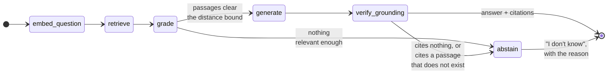

<div align="center">

<a href="https://github.com/Niloy-Bhuiyan/shuru">
  
</a>

### Find the right internship. Know where you really stand.

**Shuru** (শুরু — *the beginning*) is an internship platform for students that combines fresh opportunities, evidence-backed matching, application tracking, and an ATS-ready resume studio—without inventing confidence it cannot justify.

[](https://nextjs.org/)
[](https://www.typescriptlang.org/)
[](https://supabase.com/)
[](https://tailwindcss.com/)
[](./LICENSE)

[Why Shuru](#why-shuru) · [Features](#core-experience) · [Architecture](#architecture) · [Documentation](#documentation) · [License](#license)

</div>

---

## Why Shuru

Most internship platforms optimize for more listings and bigger match percentages. Shuru optimizes for **truthful decisions**.

> If the evidence is strong enough, Shuru explains the match. If it is not, Shuru abstains. No fake score. No invented deadline. No made-up salary.

- **Fresh over noisy** — listings are filtered, normalized, deduplicated, and freshness checked.
- **Evidence over confidence theatre** — every match signal can show what produced it.
- **Useful even without AI** — matching, ATS checks, and scoring remain rule-based and testable.

## Core experience

### `01` Internship Radar

One focused feed for employer-posted and responsibly ingested internships, with source attribution, real freshness information, and honest compensation labels.

### `02` Reality Check

Calibrated match information based on profile evidence and verified outcomes. Small cohorts produce **not enough data yet** instead of a meaningless percentage.

### `03` Resume Forge

PDF/DOCX import, structured editing, ATS readiness checks, job-description tailoring, and selectable text-layer PDF export in one dedicated workspace.

### `04` Application Vault

Save opportunities, track application stages, search the pipeline, and receive relevant deadline and status notifications.

### `05` Shuru Pro

An optional subscription over the three features that call a language model — the agent, grounded listing Q&A, and AI rewriting in the Forge. Everything Shuru computes for itself stays free and complete. Payable from a Bangladeshi mobile wallet or, from anywhere else, by card.

## Architecture

<div align="center">


<sub>Sign-in to payment, end to end. Two deployable units; requests pass role-aware Next.js boundaries, and Postgres RLS remains the final authority.</sub>

</div>

The system follows three rules:

1. **The database is the trust boundary.** Supabase Row Level Security protects data even if a route is called directly. Policies are verified by `npm run verify:rls` (config invariants) and `npm run test:rls` (behaviour, asserting the exact SQLSTATE of each denial).
2. **Core decisions stay deterministic.** Eligibility, matching, ATS scoring, and abstention are pure, unit-tested domain functions. No model decides whether you qualify.
3. **External services are optional and isolated.** A missing AI or delivery key disables that feature cleanly; it never creates fake output.

### Two deployable units

| | Runtime | Responsibility |
| --- | --- | --- |
| **Web application** | Next.js 16 (App Router), React 18, TypeScript strict | UI, route handlers, role-aware middleware, ingestion, matching |
| **Retrieval service** | Python 3.13, FastAPI, LangGraph, LangChain, pgvector | Grounded answers about listing free text, with citations and abstention |

The retrieval service is a separate REST API, not a library. It holds its own
dependencies, its own 63-test suite, and its own failure mode: when it is not
deployed, `/api/ask` reports itself unavailable and the feature hides. The web
app talks to it through one server-only client (`src/lib/rag/client.ts`), so
nothing about the Python stack leaks into the browser bundle.

### The retrieval pipeline

`services/rag` is a **LangGraph `StateGraph`**, not a chain. The branching is
the reason: three of its six nodes can end the run without an answer, and one
of them rejects a draft the model already produced.



**`verify_grounding` is the point of the whole design.** A model that answers
from a job description will happily invent a stipend or a deadline, and Shuru's
one claim is that it does not manufacture confidence. So the graph reads its own
draft, checks every citation resolves to a passage that was actually retrieved,
and throws the answer away if it does not. Written as nested `if`s, that is
precisely the check an early `return` skips.

| Concern | Choice | Why |
| --- | --- | --- |
| Orchestration | **LangGraph** `StateGraph`, 6 nodes, 2 conditional edges | Branching and self-rejection are real control flow, not a chain |
| Chunking | **LangChain** `RecursiveCharacterTextSplitter` | One well-tested utility; the framework does not own the control flow |
| Vector store | **pgvector** in the same Supabase Postgres (HNSW, cosine) | No new infrastructure; the chunk → listing foreign key cascades |
| Embeddings | **fastembed** ONNX, `bge-small-en-v1.5`, 384-dim, local | A real model with **no API key** — clone the repo and retrieval runs |
| Answer generation | Anthropic, behind an adapter | The only step needing a hosted credential |
| Abstention threshold | **0.46**, measured | On-topic scored 0.239–0.385, off-topic 0.532–0.598. The shipped default of 0.75 answered *"what is the weather in Dhaka?"* from a job description |

The threshold is pinned by `tests/test_threshold.py`, which includes a test
that fails if anyone restores the old default. Prompt-injection defence is
three layers — fenced documents, delimiter sanitising, advisory detection that
never blocks — and `rag_chunks` has no write policy at all, so no user can
inject retrievable text in the first place.

### Three roles, three products

A role is decided once, at signup, by `handle_new_user()` — a trigger on
`auth.users` that claims a matching row in `role_invites` and otherwise writes
`student`. Each role then lands in a workspace that does not acknowledge the
others exist.

| Role | Workspace | Sees |
| --- | --- | --- |
| **Student** | `(main)` | Radar, Reality Check, Forge, Vault, their own billing |
| **Employer** | `(operator)/employer` | Their company, listings, applicant pipeline |
| **Admin** | `(operator)/admin` | Moderation queues, employer access, referrals, transactions |

The student app contains **no link to either console** — not in the sidebar,
not in the header, not on the profile page. Operators arrive at their console
by signing in. That is deliberate: an earlier version appended an "ADMIN" chip
to the student navigation, which meant one account wearing two products at once
with no way to tell which one you were in.

**Only an admin can make another admin.** Referral is keyed to an email
address rather than a shareable code, and every policy on `role_invites` is
gated on `is_admin()`. There is no redemption RPC anywhere in the schema, and
[migration 0017](./supabase/migrations/0017_role_invites_by_email.sql) explains
at length why: a `SECURITY DEFINER` function that grants a role in response to
an attacker-controllable string is a privilege-escalation primitive however
carefully it is written. Keying the invite to the address Supabase Auth has
already verified removes the need for one. A leaked invite is useless to
anyone but the named address — that is the same property as its main cost.

### Shuru Pro, and how money actually moves

Pro covers exactly three capabilities, and they are the three that spend money
on a model call per use: the agent (`/api/agent`), grounded listing Q&A
(`/api/ask`), and AI rewriting in the Forge (`/api/forge-section`). Matching,
the Reality Check, eligibility, ATS scoring, résumé building and export, the
radar feed, saving and the whole application pipeline stay free — those are the
parts Shuru computes itself, and charging for them would mean charging for the
half that cannot be wrong while giving away the half that can.

Two settlement paths, both real:

| Path | Methods | How it settles |
| --- | --- | --- |
| **Automatic** | Card, Demo | Hosted sandbox checkout → **HMAC-signed webhook** with a unique event id. Real signature check, real idempotency, real server-authoritative fulfilment. No money moves and no card is collected. |
| **Human** | bKash, Nagad, Rocket | The payer sends from their own wallet app and submits the transaction ID. **An admin matches it against the merchant statement** before anything is granted. Real money. |

The second path is not a stub standing in for an integration. bKash Tokenized
Checkout and the Nagad merchant API both need credentials issued after a
business KYC, so without them the choice is not "API or manual" — it is
"manual, or a screen that asks for a wallet PIN and pretends". Publishing a
merchant number and taking the transaction ID afterwards is what a great many
Bangladeshi merchants genuinely do, and the payer's PIN never leaves their
wallet app. **No screen in this repository collects a card number, a CVV, a
wallet PIN or an OTP, and none may be added.**

Four properties hold regardless of which path was used:

1. **Price and duration are server-side.** The request body says only which
   plan and which method. `amount_minor` and `entitlement_days` are read from
   `PRO_PLANS` in `src/lib/subscription.ts`, never from the client — a policy
   permissive enough to let a browser insert a subscription payment is
   permissive enough to let it buy a decade for one paisa.
2. **Nobody can grant themselves anything.** `subscriptions` has exactly one
   RLS policy and it is `SELECT`. The only writer is the service role, from
   the webhook handler or the admin decision route.
3. **An admin cannot approve their own payment.** Shuru mints admins by
   referral from other admins, so without that check a free subscription would
   be one referral away, with an audit trail saying it was reviewed.
4. **One function grants.** Both paths call `grantEntitlement()`, which reads
   the stored payment row and nothing else, and which extends an unexpired
   period rather than restarting it — renewing early must not silently delete
   the days already bought.

Mobile methods are available only while a receiving number is configured
(`PAYMENT_MERCHANT_BKASH`, `PAYMENT_MERCHANT_NAGAD`, `PAYMENT_MERCHANT_ROCKET`);
otherwise the method reports itself unconfigured and names the variable, rather
than showing a payer a number to send money to that nobody owns. Card and Demo
need no configuration, so the full sign-in → checkout → entitlement path is
walkable on any deployment.

Read the complete [architecture guide](./docs/ARCHITECTURE.md) for authorization, data flows, ingestion, matching, and delivery details.

## Development

```bash
npm install
npm run dev
```

Shuru requires a configured Supabase project. Environment setup, database migrations, and production deployment are documented in the [deployment guide](./docs/DEPLOYMENT.md).

The pre-release gate:

```bash
npm run typecheck && npm run lint && npm test
npm run test:e2e      # Playwright at 390px and 1440px, incl. accessibility
npm run build         # must print "ƒ Proxy (Middleware)"
npm run verify:rls    # database security invariants + RLS behaviour tests
```

## Documentation

- [Product requirements](./docs/PRD.md) — users, scope, requirements, and non-goals
- [Architecture](./docs/ARCHITECTURE.md) — runtime, authorization, and data pipelines
- [Database](./docs/DATABASE.md) — tables, RLS policies, constraints, and triggers
- [Deployment](./docs/DEPLOYMENT.md) — Supabase and Vercel provisioning
- [Operations runbook](./docs/RUNBOOK.md) — release checks and failure triage
- [Engineering decisions](./docs/decisions) — load-bearing trade-offs and context
- [Retrieval service](./services/rag/README.md) — the Python RAG service: design, API, tuning, limitations

> [!IMPORTANT]
> Read [ADR 0001](./docs/decisions/0001-source-filtering.md) before changing source filters, [ADR 0002](./docs/decisions/0002-match-abstention.md) before changing score availability, and [ADR 0003](./docs/decisions/0003-paid-placement.md) before changing how promoted listings are ranked. All three encode deliberate honesty constraints. [ADR 0004](./docs/decisions/0004-ai-assisted-discovery.md) is a *proposal*, not built — read it before attempting AI-assisted listing discovery, particularly the part explaining why a Claude or ChatGPT subscription cannot be delegated to a third-party app.

## License

> [!WARNING]
> **PROPRIETARY SOFTWARE — NO OPEN-SOURCE LICENSE IS GRANTED.**
>
> Copyright © 2026 Niloy Bhuiyan. All rights reserved. Copying, using, modifying, redistributing, publishing, sublicensing, selling, or creating derivative works from this repository requires prior written permission from Niloy Bhuiyan. Unauthorized use is expressly prohibited.

Read the complete [LICENSE](./LICENSE) before using any part of this project.

---

<div align="center">

### শুরু মানে সূচনা — go open some doors.

Designed and built by [Niloy Bhuiyan](https://github.com/Niloy-Bhuiyan).

[Back to top](#)

</div>
